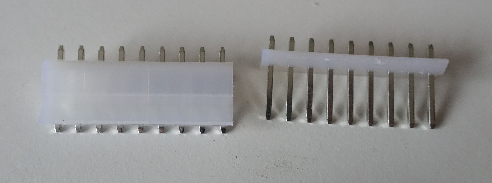

# RP2040 PlayStation adapter
This project is a simple PlayStation 1/2 controller port to USB C adapter. I made it so that I would be able to use it with the cheap, second hand, PlayStation 2, Taiko no Tatsujin drum, which I bought while in Japan.

I only wrote software for the Taiko drum, but in theory, all of the hardware is there to support a lot of different kinds of PlayStation controllers. The firmware can be found [here](https://github.com/TT-392/playstation_adapter_code).

## Using the hardware with non Taiko drum controllers
If you want to use this hardware with other PlayStation controllers, you are going to have to write your own firmware. For details on how to do this, I recommend the following source: [Interfacing a PS2 (PlayStation 2) Controller](https://store.curiousinventor.com/guides/PS2/).

One thing to keep in mind is power requirements of the controller you are using. I haven't found much information on how much power controllers pull (not that I put in that much effort), except for what is mentioned in the aforementioned source. Therefore, I can only give information on the power supply situation of this PCB.
* Pin 5 (power). This pin gets 3.3V through an AMS1117-3.3 voltage regulator. This voltage regulator is rated for 1A (though, this does assume that it is able to get rid of the heat), but that does assume that your USB port is able to supply that. Therefore, its power rating is, whatever your USB port is able to deliver if that is < 1A, otherwise 1A.
* Pin 3 (vibrator power). This pin is connected to the USB port VBUS pin (5V) through a 0 ohm resistor, so it can be enabled or disabled by placing or not placing that resistor. I don't know how this pin is usually used, because I only have a Taiko drum, and that drum doesn't have a vibration motor, but it felt like a good idea to give the option to leave it unconnected in case there exists a controller which pulls too much power for a USB port with the vibration motor powered, but not without it powered (assuming the controller would even work like that).
* I referred to USB power in those last 2 points. This table on [Wikipedia](https://en.wikipedia.org/wiki/USB#Power) should help you in figuring out what that is. Keep in mind that the type-c power delivery standards need extra communication between your device and the supply, and therefore cannot be used in this case. While with the BC 1.1 and 1.2 specs, you are supposed to check if there is a resistor between the D+ and D- lines to check if you are allowed to pull that much power, this PCB doesn't have the hardware to check that, but (although it is probably a bad idea), nothing is stopping you from pulling that much from ports capable of this.

## Ordering
I used JLCPCB to order my PCBs with all of their parts already pick and placed. I used [this](https://github.com/Bouni/kicad-jlcpcb-tools) plugin to do this. However, if you just want to order the same PCBs as I did, without any modifications, you can just grab the production files from the "JLCPCB" folder, or from the "releases" tab on github. The rest of this guide assumes you have your PCBs with the SMD components fully assembled at JLCPCB (nothing is stopping you from soldering them on yourself of course).

Apart from the PCBs, you should get your hands on some PlayStation controller ports with 90 degree pins. I got mine from [AliExpress](https://www.aliexpress.com/item/32818887920.html?spm=a2g0o.order_list.order_list_main.17.45ed1802iEjUwq) (AliExpress links rot quickly, but you should be able to find something similar). And some 9 pin, 3.96mm pitch pin header, I used [these](https://www.lcsc.com/product-detail/_BOOMELE-Boom-Precision-Elec-_C10586.html) (At the time of writing, you get free shipping on LCSC, if your recently ordered something from JLCPCB). And if you want some protection for your board, get some 50mm diameter heat-shrink (I got [this](https://www.aliexpress.com/item/1005002849810793.html?spm=a2g0o.order_detail.order_detail_item.3.59a3f19cWbd98H) stuff from AliExpress, seems to work well).

## assembly
If you followed the ordering instructions, you should now have a PCB that looks something like one of these:

Because the 90 degree PlayStation ports don't quite reach to the PCB, a we need something to bridge the gap. To do this, I decided to use some 3.96mm pitch, 9 pin pin headers, sadly, I couldn't find any without a plastic tab, so I just got the ones that looked like they had a tab that was easy to remove. So that is the first step in assembly, remove this tab, like is shown in the following image:

Next, this header should be soldered to the PCB, I have found that it works best if you solder on the connector with the pins sticking out about 5 mm, and with the side of the connector that has the least plastic, pointing to the edge of the board, to allow for easier snipping later (I found out about this orientation trick in the next one I assembled, therefore the pictures have the connector rotated by 180 degrees compared to what I am saying here).

Next, we glue (I used hot glue) the connector to the bottom side of the PCB, with the pins as close as possible to the pin header's pins, like shown in the following picture

The next step is to solder these pins together, be sure to use ample solder, to make sure the pins really have a good connection.

After you have soldered these pins together, you can go ahead and use some side cutters to cut the pins of the connector on the other side of the board. The result of these two steps can be seen in the following image:

Now it is time to heat shrink our adapter for some extra protection. Cut off a decent size piece of the heat shrink, so that the adapter can sit inside, with ample space on both sides:

Now use a heat gun to shrink the heat-shrink:

Now we can cut away the excess heat-shrink (I used normal scissors, just make sure they are scissors that close well), and we have our finished adapter:

